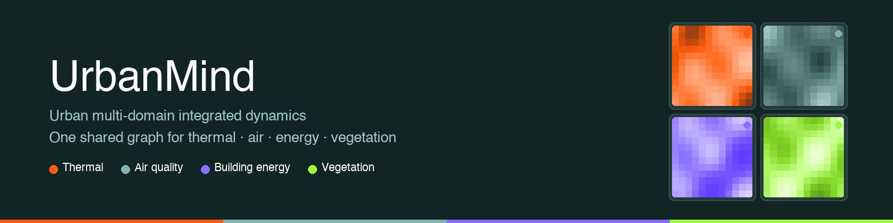
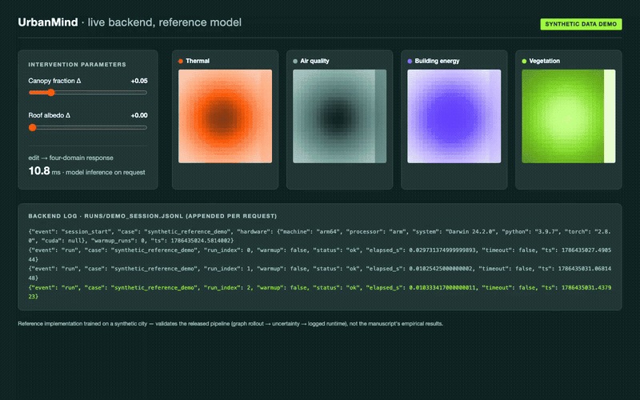

**Urban Multi-domain Integrated Dynamics** — a knowledge-enhanced cross-domain tool
for urban ecological environment evaluation and design integration.

UrbanMind represents thermal, atmospheric, building-energy, and vegetation states on a
shared heterogeneous graph, grounds scenario responses in curated physical constraints
and intervention evidence (KRCG: knowledge retrieval and constraint grounding), and
links to Rhino/Grasshopper for synchronized parameter updates.

> Companion code for the manuscript *"From fragmented simulation to integrated
> assessment: A knowledge-enhanced cross-domain tool for urban ecological environment
> evaluation"* (Building and Environment, under review).

## Demo



Live session against the released backend: intervention sliders (canopy fraction,
roof albedo) drive real model inference; the four domain fields, per-request latency,
and the appended `runs/demo_session.jsonl` log lines update on every edit. The model
here is the reference implementation trained on a **synthetic city**
(`demo/train_synthetic.py`) — it validates the released pipeline, not the
manuscript's empirical results.

- Full video: [`docs/media/urbanmind_backend_demo.mp4`](docs/media/urbanmind_backend_demo.mp4)
- Run it yourself: `python demo/train_synthetic.py && python demo/serve_demo.py`,
  then open <http://127.0.0.1:8787>
- Grasshopper client: paste `gh_bridge/UrbanMind_GH_component.py` into a Rhino 8
  Python 3 Script component (see `docs/grasshopper_recording.md`)

## Architecture

```
Layer One   Data infrastructure      urbanmind/data/
Layer Two   Stage 1  Multi-scale graph world model      urbanmind/model/world_model.py
            Stage 2  KRCG physical grounding            urbanmind/model/krcg.py, grounding.py
            Stage 3  Decision generation & uncertainty  urbanmind/model/uncertainty.py
Layer Three Design integration (Grasshopper bridge)     urbanmind/gh_bridge/
```

## Repository layout

| Path | Purpose |
|---|---|
| `urbanmind/data/` | 500 m grid, spatial blocking, temporal harmonization audit, PRISMA Track A/B record-level assignment |
| `urbanmind/model/` | Heterogeneous graph, coupling tensor, FiLM rollout, KRCG retrieval, constraint projection, sub-grid downscaling, uncertainty decomposition |
| `urbanmind/train/` | Three-phase training (masked autoencoding → grounding → intervention fine-tuning) |
| `urbanmind/eval/` | Experiments 1–3, unified statistical protocol (cluster bootstrap + Holm), calibration evaluation |
| `urbanmind/runtime/` | Timestamped per-run benchmark logging for the <30 s interactive claim |
| `urbanmind/gh_bridge/` | HTTP endpoint consumed by the Grasshopper component |
| `scripts/` | Record-assignment table generation, runtime benchmark, synthetic end-to-end demo |
| `tests/` | Smoke tests on synthetic data |

## Reproducibility artifacts

These modules generate the supplementary artifacts referenced in the manuscript:

- **Record-level Track A/B split** (`urbanmind/data/tracks.py`,
  `scripts/make_record_assignment.py`) — DOI- and study-site-disjoint partition of the
  intervention library between Phase-3 fine-tuning and Experiment-2 validation
  (manuscript Appendix A.5).
- **Temporal harmonization audit** (`urbanmind/data/temporal.py`) — per-variable
  proportions of measured / interpolated / rule-based downscaled / missing values with
  stagewise uncertainty inflation (Appendix A.9).
- **Unified statistical protocol** (`urbanmind/eval/stats.py`) — paired cluster
  bootstrap over independent units, Cohen's d, Holm correction within pre-declared
  test families (Section 4.5).
- **Uncertainty calibration** (`urbanmind/eval/calibration.py`) — coverage, interval
  width, expected calibration error, reliability diagrams (Appendix A.11).
- **Runtime evidence** (`urbanmind/runtime/benchmark.py`) — per-run timestamped logs,
  warm-up discards, failure/timeout records, hardware capture (Section 5.4).

## Quick start

```bash
python -m venv .venv && source .venv/bin/activate
pip install -r requirements.txt

# End-to-end smoke run on synthetic data (no external data needed)
python scripts/synthetic_demo.py

# Run the test suite
pytest tests/
```

## Data

The gridded observation data (NOAA ISD, EPA AQS, NEA, CNEMC, MODIS, Sentinel-2, city
energy disclosures) must be obtained from their original providers; see manuscript
Section 3.1 and Appendix A.2 for sources and harmonization rules. Loaders in
`urbanmind/data/` operate on the harmonized 500 m daily grid format documented there.

## License

MIT — see `LICENSE`.
